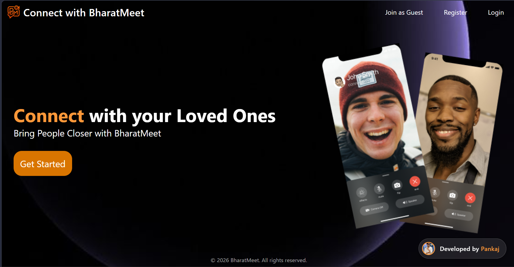
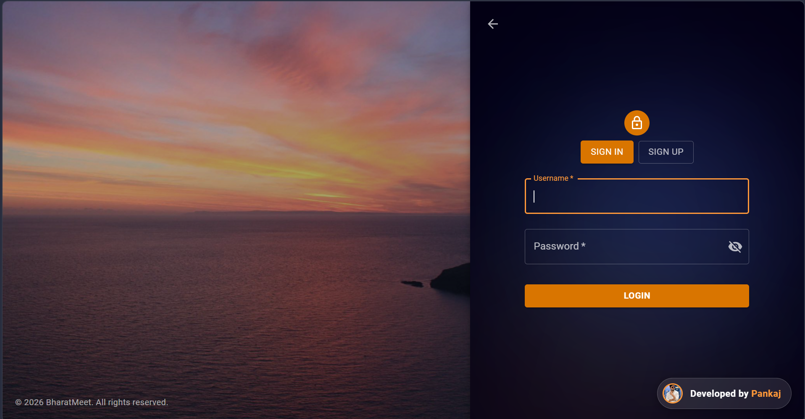
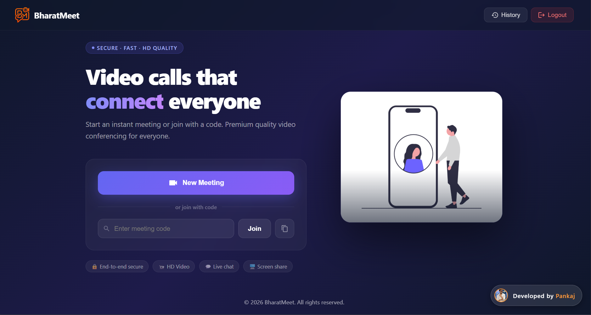
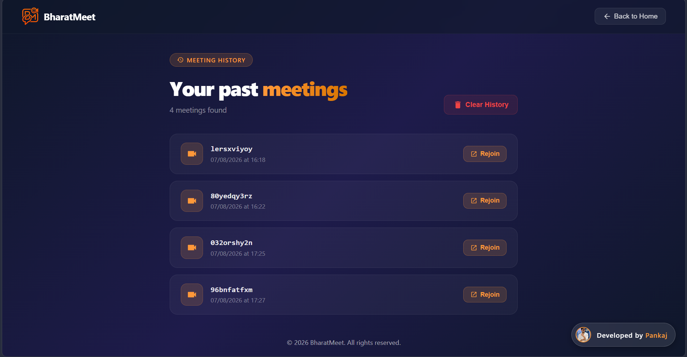
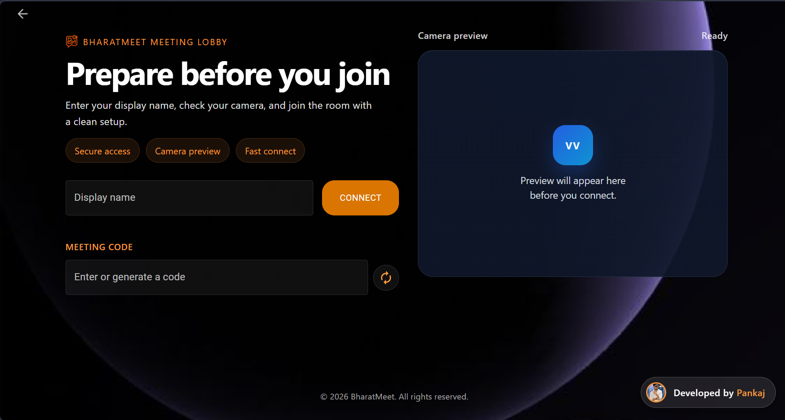
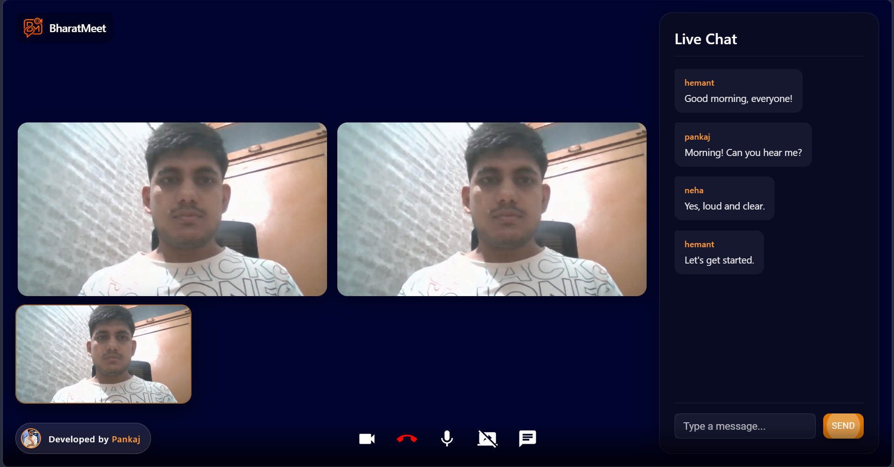
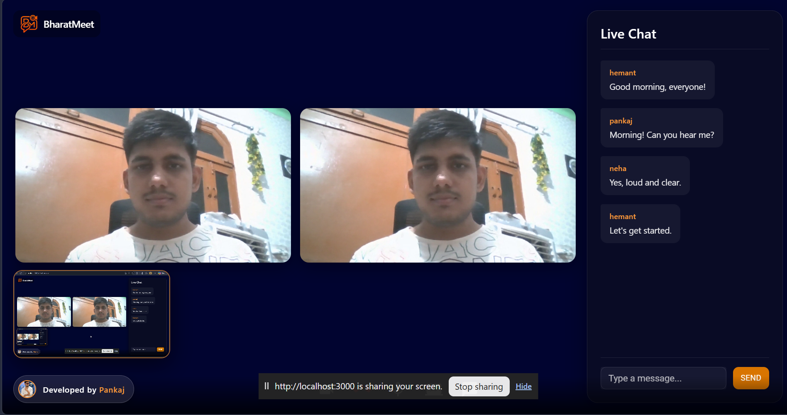

# 🚀 BharatMeet | Real-Time Video Conferencing Platform

[](https://reactjs.org/)
[](https://nodejs.org/)
[](https://expressjs.com/)
[](https://www.mongodb.com/)
[](https://socket.io/)
[](https://webrtc.org/)
[](https://mui.com/)

---

🌐 **🚀 Live Demo:** https://bharatmeet-app.onrender.com  
📌 **GitHub Repo:** https://github.com/Pankaj001238072/BharatMeet

---

## 💡 About the Project

**BharatMeet** is a full-stack, real-time video conferencing application designed to provide seamless and secure communication. 

Built with modern web technologies, it allows users to create instant meetings, join via unique codes, chat in real-time, and share their screens. It focuses on a clean, responsive UI and low-latency communication using WebRTC and Socket.io.

---

## 🎯 Problem It Solves

With remote work and virtual connections becoming the norm, users need a fast, reliable, and hassle-free way to communicate without downloading heavy desktop applications.

**BharatMeet solves this by:**
* 🔗 One-click meeting generation
* 💬 Integrated real-time chat during video calls
* 🖥️ Seamless screen sharing for presentations and collaboration
* 📜 Keeping a history of past meetings for easy re-joining

---

## 📸 Screenshots

### 🚀 Landing Page (`/`)


### 🔐 Authentication (`/auth`)


### 🏠 Home Dashboard (`/home`)


### 📜 Meeting History (`/history`)


### 🚪 Meeting Lobby (`/join`)


### 💬 Video Call with Chat


### 🖥️ Video Call with Screen Share


---

## 🌟 Key Features

### 🔐 Secure & Seamless Access
* User Authentication (Signup/Login) securely stored in MongoDB using bcrypt.
* "Join as Guest" functionality for quick access without registration.
* Secure and isolated meeting rooms with unique generated codes.

### 🎥 High-Quality Communication
* Real-time Video and Audio streaming using **WebRTC**.
* **Meeting Lobby** to preview and adjust the camera/microphone before joining.
* **Screen Sharing** capability for effective presentations.

### 💬 Interactive Collaboration
* **Live Chat** inside the meeting room with real-time syncing via Socket.io.
* Copy and share meeting links instantly with one click.

### 📜 Dashboard & History
* Modern User Dashboard (Home Page) to manage meetings.
* **History Page** that tracks all past meetings attended by the user, with an option to quickly "Rejoin" or "Clear History".

---

## ⚡ Engineering Highlights

* **WebRTC & Socket.io Integration:** Achieved real-time, peer-to-peer media streaming with minimal latency. Signaling is handled flawlessly by a custom Socket.io backend.
* **Responsive Modern UI:** Completely custom-designed responsive layout using CSS and Material-UI components, ensuring the app looks beautiful on desktop, tablet, and ultra-small mobile screens (e.g., 270px width).
* **Dynamic Environment Configurations:** Automated detection for switching between `localhost` (Development) and Render (Production) API endpoints.

---

## 🛠️ Tech Stack

### Frontend
* **Library:** React.js
* **Routing:** React Router DOM
* **Styling:** Custom CSS, Material UI (MUI) components & icons
* **State Management:** React Context API

### Backend
* **Runtime:** Node.js
* **Framework:** Express.js
* **Real-time Engine:** Socket.io
* **Database:** MongoDB & Mongoose
* **Security:** bcrypt, CORS, dotenv

---

## 📂 Project Structure

```
BharatMeet/
├── backend/
│   ├── src/
│   │   ├── controllers/      # Socket managers & user controllers
│   │   ├── models/           # MongoDB schemas (User, Meeting)
│   │   ├── routes/           # Express API routes
│   │   └── app.js            # Main backend server entry point
│   ├── .env                  # Backend Environment variables
│   └── package.json
│
├── frontend/
│   ├── public/
│   ├── src/
│   │   ├── components/       # Reusable UI components (e.g., DeveloperBadge)
│   │   ├── contexts/         # Context API for Global State (Auth)
│   │   ├── pages/            # Main Screens (Home, Landing, VideoMeet, Auth, History)
│   │   ├── environment.js    # Dynamic API URL config
│   │   └── App.js            # Frontend Routing
│   └── package.json
└── README.md
```

---

## 🚀 Setup Instructions (Local Development)

### 1️⃣ Clone the Repository
```bash
git clone https://github.com/Pankaj001238072/BharatMeet.git
```

### 2️⃣ Backend Setup
```bash
cd backend
npm install
```
* Create a `.env` file in the `backend` directory:
```env
MONGO_URI=your_mongodb_connection_string
```
* Start the backend server:
```bash
npm start
```

### 3️⃣ Frontend Setup
Open a new terminal and run:
```bash
cd frontend
npm install
npm start
```
* The application will run on `http://localhost:3000`

---

## 📩 Contact

Developed by **Pankaj Singh**

🔗 **LinkedIn:** [Pankaj Singh](https://www.linkedin.com/in/pankaj-878772224/)  
📧 **Email:** pankajsaini71004@gmail.com  

---

## ⭐ Support

Give a ⭐ if you like the project!

---

License: MIT
